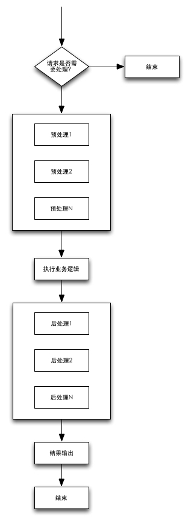

# web-framework
目标：抽象web的执行流程，让框架维护者能自由扩展，让业务开发人员专注于业务开发，减少框架层面的配置。

# 抽象的web执行流程

# 使用说明

* pom依赖web-framework-core
* 编写MainFilter & web.xml配置
* 编写API
* (optional)增加ApiExecutePreProcessor
* (optional)增加ApiExecutePostProcessor
* (optional)增加Response返回类型
